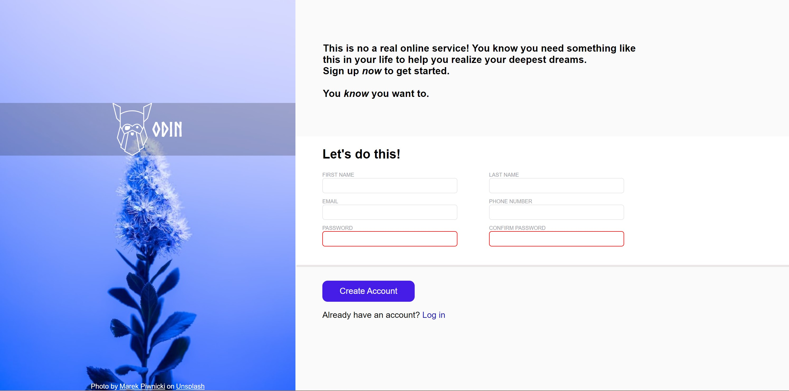

# Signup Form with HTML and CSS

## Description

This project is a signup form built using HTML and CSS. The form includes inputs for name, email, password, and confirm password. Users can create an account or log in using this form.

## Preview

## Usage

1. Fill in your name, email, password, and confirm password in the respective input fields.
2. Click the "Create Account" button to create a new account.
3. If you already have an account, click the "Log In" button to sign in.

## Technologies Used

- HTML
- CSS

## Credits

- [The Odin Project](https://www.theodinproject.com/)

**Note:** The Odin Project logo is used under fair use for educational purposes and is the property of The Odin Project.

**Signup Form - Project Update**
I want to provide you with an update regarding the current state of the signup form for my project. As of now, the signup form has been successfully implemented with basic fields for name, email, password, and confirm password. However, I regret to inform you that certain essential features, such as password validation and other properties, have not been included in the initial version.
 Although some key functionalities are missing at the moment, I am fully aware of their importance, and I intend to implement them in the near future.

**Upcoming Features and Enhancements:**

1. **Password Validation:** I recognize the significance of password security, and I plan to incorporate password validation to ensure strong and secure passwords are used.

2. **Form Validation:** In addition to password validation, I will be implementing form validation to ensure that all required fields are filled out correctly before the form is submitted.

3. **User-Friendly Error Handling:** Clear and user-friendly error messages will be added to guide users in case of any input errors.

4. **Enhanced Styling and Responsiveness:** The form's appearance and layout will be further improved to provide a more polished and visually appealing user experience across different devices and screen sizes.

5. **Accessibility Considerations:** I will strive to make the form accessible to all users, including those with disabilities, by adhering to best practices in web accessibility.
